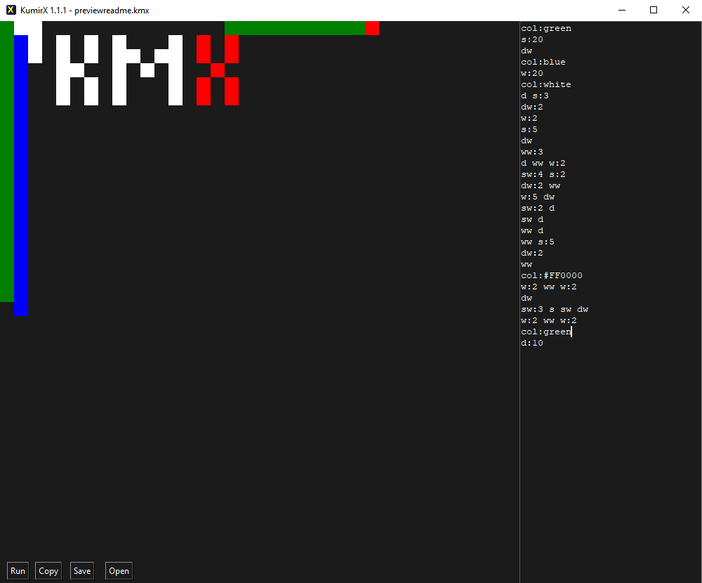

# KumirX
**KumirX** - is an analog of a russian programming system "Кумир" (Kumir). Its like a Turtle pseudo-programming language for russian schools.

Kumir




## Code examples:

All Of these code will display minimalistic Linux Mint logo:\
```s:4 d:6 w:4 a:2 s:2 a ww:2 a s:3 aw ww:4```\
```down:4 right:6 up:4 left:2 down:2 left upw:2 left down:3 leftw upw:4```\
```down:4 right:6 up:4 left:2 down:2 left upwithout:2 left down:3 leftwithout upw:4```\
```↓:4 →:6 ↑:4 ←:2 ↓:2 ← ↑w:2 ← ↓:3 ←w ↑w:4```

## Shortcuts in `gen.py`

`WASD` - Move turtle to up, left, down, right\
`Ctrl+WASD` - Move turle without paint\
`Alt+WASD` - Erase (Don't work in Kumir)

## Settings
### Programm system
Translates your code to selected programm system.

`Kumir` - original KumirX reference. Code example: `вниз закрасить вправо закрасить верх влево`\
`KumirX letters` - KumirX code with commands as letters WASD. Code example: `s d ww aw`\
`KumirX fullwords` - KumirX code with commands as words and full arguments. Code example: `down right upwithout leftwithout`\
`KumirX words` - KumirX code with commands as words and abbreviated arguments. Code example: `down right upw leftw`\
`KumirX arrows` - KumirX code with commands as arrow symbols (↑←↓→). Code example: `↓ → ↑w ←w`

## Commands:
### Moves with paint:
`w`, `up`, `↑` - move turtle up\
`a`, `left`, `←` - move turtle left\
`s`, `down`, `↓` - move turtle down\
`d`, `right`, `→` - move turtle right

### Moves without paint:
`ww`, `upw`, `wwithout`, `upwithout`, `↑w` - move turtle up without paint\
`aw`, `leftw`, `awithout`, `leftwithout`, `←w` - move turtle left without paint\
`sw`, `downw`, `swithout`, `downwithout`, `↓w` - move turtle down without paint\
`dw`, `rightw`, `dwithout`, `rightwithout` `→w` - move turtle right without paint

### Moves with erase
`wd`, `upd`, `wdelete`, `updelete`, `↑d` - move turtle up and erase this tile\
`ad`, `leftd`, `adelete`, `leftdelete`, `←d` - move turtle left and erase this tile\
`sd`, `downd`, `sdelete`, `downdelete`, `↓d` - move turtle down and erase this tile\
`dd`, `rightd`, `ddelete`, `rightdelete` `→d` - move turtle right and erase this tile

### Other
`color`, `col`, `c` - Changes a color of trail\
`cooldown`, `cd` - Adds cooldown between tile paint (broken)\
`setpos`, `set`, `pos`, `sp` - Changes a position of turtle\
`pointercolor`, `pointercol`, `pcol`, `pc` - Changes a color of turtle\
`scale`, `sc` - Changes scale of one tile (in pixels, default is 20)\
`word`, `wo` - Displays a word


## Operators:
`:` - Multiplies a command or assign a value to variable. Examples:

`s:{value}` - Moves {value} tiles down\
`scale:{value}` - Assign a tile size to {value} pixels\
`pos:{x}:{y}` - Sets a turtle position to {x}, {y}\
`word:{word}` - Display a {word} by tiles
